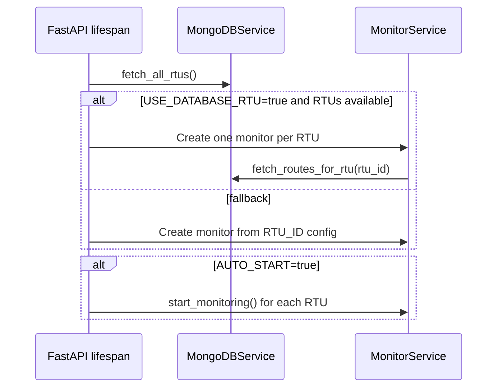
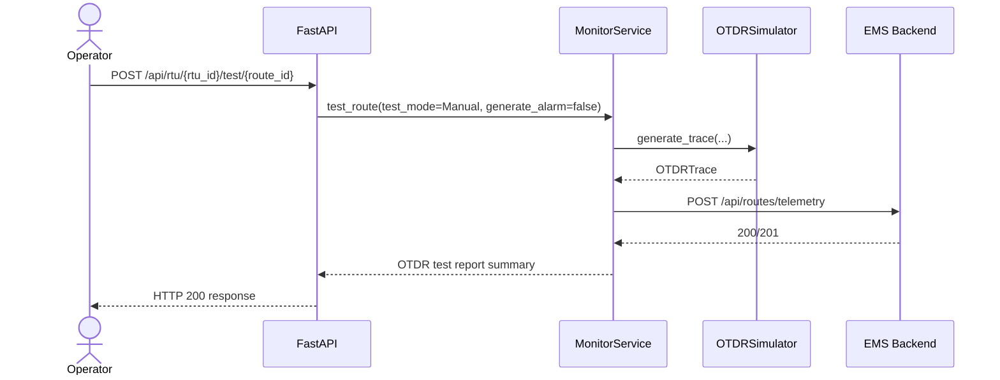
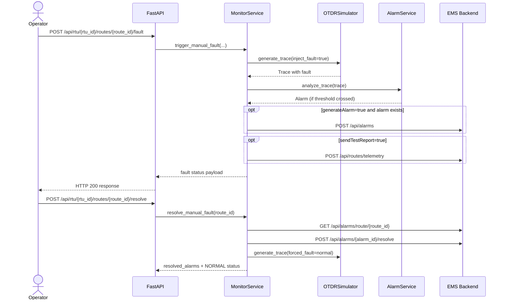
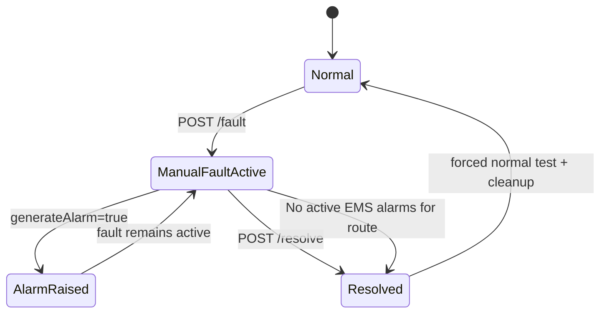

# NQMS RTU Emulator

FastAPI-based Remote Test Unit (RTU) emulator for fiber network supervision.

This service simulates OTDR measurements, manages route-level monitoring, injects and resolves manual faults, generates alarms and KPIs, and exchanges telemetry with the EMS backend.

## Table of Contents

- [What This Service Does](#what-this-service-does)
- [System Context](#system-context)
- [Internal Architecture](#internal-architecture)
- [Runtime Flows](#runtime-flows)
- [Monitoring and Scheduling Model](#monitoring-and-scheduling-model)
- [OTDR Simulation Model](#otdr-simulation-model)
- [Alarm Model](#alarm-model)
- [API Reference](#api-reference)
- [Configuration Reference](#configuration-reference)
- [Run with Docker Compose](#run-with-docker-compose)
- [Run Locally](#run-locally)
- [Examples](#examples)
- [Data and File Conventions](#data-and-file-conventions)
- [Project Structure](#project-structure)
- [Troubleshooting](#troubleshooting)

## What This Service Does

The emulator can run in two modes:

- Multi-RTU mode (default): loads RTUs and their routes from MongoDB.
- Legacy single-RTU mode: uses environment variables and static route IDs.

Main responsibilities:

- Expose REST endpoints for RTU control, route testing, fault injection, and KPI access.
- Create one `MonitorService` instance per RTU.
- Simulate OTDR traces using route reference files (`*-dump.json`, `*-trace.dat`) when available.
- Fall back to synthetic trace generation when reference files are missing.
- Send telemetry, alarms, and KPIs to EMS backend APIs.
- Persist generated KPIs in MongoDB.

## System Context

```mermaid
flowchart LR
    subgraph Clients[Operators and Clients]
        U1[Dashboard]
        U2[Test UI / API Client]
    end

    subgraph RTUEmu[rtu-emulator container]
        API[FastAPI API]
        MON[MonitorService per RTU]
        OTDR[OTDRSimulator]
        ALM[AlarmService]
        KPI[KpiService]
        MDB[MongoDBService]
        EMSC[EMSClient]
    end

    subgraph Data[Data Sources]
        RFILES[Routes reference files]
        MONGO[(MongoDB nqms)]
    end

    subgraph EMS[ems-backend]
        AAPI[/api/alarms]
        TAPI[/api/routes/telemetry]
        KAPI[/api/kpis]
    end

    U1 --> U2
    U2 --> API
    API --> MON
    MON --> OTDR
    MON --> ALM
    MON --> KPI
    MON --> MDB
    KPI --> MDB
    MDB --> MONGO
    OTDR --> RFILES
    MON --> EMSC
    EMSC --> AAPI
    EMSC --> TAPI
    EMSC --> KAPI
```

## Internal Architecture

Component responsibilities:

- `main.py`
  - FastAPI app lifecycle.
  - RTU monitor initialization from MongoDB or fallback config.
  - HTTP endpoints.

- `monitor_service.py`
  - Core orchestration per RTU.
  - Test scheduling, manual fault state, route status updates.
  - Telemetry, alarm, and KPI dispatch.

- `otdr_simulator.py`
  - Loads and caches route reference datasets.
  - Generates OTDR traces, applies fault injection, computes status.
  - Adds RTU health metrics (temperature, CPU, memory, power).

- `alarm_service.py`
  - Converts OTDR traces into alarm objects.
  - Severity prioritization and duplicate suppression.

- `ems_client.py`
  - HTTP client to EMS APIs with retry logic.
  - Sends alarms, route telemetry, KPIs.
  - Resolves active alarms for a route.

- `kpi_service.py`
  - Builds network, route, alarm-statistics, and availability KPIs.

- `mongodb_service.py`
  - Reads RTUs/routes from MongoDB.
  - Stores KPI documents.

## Runtime Flows

### 1) Startup and Multi-RTU Initialization



### 2) Manual Route Test

`POST /api/rtu/{rtu_id}/test/{route_id}` triggers a test and sends telemetry.

Important current behavior:

- This endpoint runs with `generate_alarm=false`.
- It updates route status and sends a test report to EMS.
- It does not create new alarms directly.



### 3) Manual Fault Injection and Resolution



### 4) Fault State Lifecycle



## Monitoring and Scheduling Model

`MonitorService` loop ticks every second while monitoring is active.

Scheduled jobs:

- Auto OTDR tests:
  - Run only when `otdr_test_mode=auto`.
  - Period controlled by `otdr_test_period_seconds` (minimum 30 seconds).

- KPI generation:
  - Runs every `max(60, monitoring_interval * 5)` seconds.
  - Generates: network health, route performance, alarm statistics, availability.

Notes:

- `AUTO_START=false` means monitoring must be started via API.
- `test_all_routes()` currently uses `generate_alarm=false` for periodic checks.

## OTDR Simulation Model

Reference-first simulation strategy:

1. Try loading route reference bundle from `ROUTES_REFERENCE_DIR`.
2. If both event JSON and trace DAT exist, generate traces from real-like data.
3. If not, generate synthetic events and losses.

Status derivation rules:

- `BREAK` if any break event exists, or total loss exceeds break threshold.
- `DEGRADATION` if total loss is between degradation and break thresholds.
- `NORMAL` otherwise.

Fault types supported by manual injection:

- `break`
- `degradation`
- `high_loss_splice`
- `normal` (used for resolution flow)

Power behavior:

- Baseline average power comes from reference traces (or synthetic baseline).
- Random variation uses configured min/max bounds.
- Faults apply deterministic or random penalty depending on fault mode.

## Alarm Model

Alarm types generated by analysis:

- `FIBER_BREAK` (CRITICAL)
- `DEGRADATION` (MEDIUM)
- `HIGH_EVENT_LOSS` (HIGH)

Selection and suppression:

- When multiple alarm candidates exist, the highest severity is selected.
- Duplicate alarms per route/type are suppressed for `alarm_duplicate_suppression_seconds`.

Threshold inputs:

- `alarm_threshold_degradation`
- `alarm_threshold_break`
- `event_loss_threshold`

## API Reference

Base URL (default): `http://localhost:8001`

OpenAPI/Swagger:

- `GET /docs`
- `GET /openapi.json`

### Service and Health

| Method | Endpoint | Description |
|---|---|---|
| GET | `/` | Service info, active RTU count, RTU IDs |
| GET | `/health` | Health status and timestamp |

### RTU Overview and Control

| Method | Endpoint | Description |
|---|---|---|
| GET | `/api/rtus` | List all active RTU monitor statuses |
| GET | `/api/rtu/{rtu_id}/status` | Detailed status for one RTU |
| POST | `/api/rtu/{rtu_id}/start` | Start monitoring loop for one RTU |
| POST | `/api/rtu/{rtu_id}/stop` | Stop monitoring loop for one RTU |

### OTDR Configuration

| Method | Endpoint | Description |
|---|---|---|
| GET | `/api/rtu/{rtu_id}/otdr-config` | Get mode/period and next auto-test time |
| PUT | `/api/rtu/{rtu_id}/otdr-config` | Update mode (`manual`/`auto`) and period |

Update payload:

```json
{
  "mode": "auto",
  "periodSeconds": 300
}
```

### Route Operations

| Method | Endpoint | Description |
|---|---|---|
| GET | `/api/rtu/{rtu_id}/routes` | List routes for RTU |
| GET | `/api/rtu/{rtu_id}/routes/{route_id}` | Route details |
| POST | `/api/rtu/{rtu_id}/test/{route_id}` | On-demand route test |
| GET | `/api/rtu/{rtu_id}/routes/{route_id}/trace-reference` | Sampled reference trace points |
| POST | `/api/rtu/{rtu_id}/routes/{route_id}/fault` | Inject manual fault |
| POST | `/api/rtu/{rtu_id}/routes/{route_id}/resolve` | Resolve manual fault and route alarms |

Trace-reference query:

- `maxPoints`: clamped between 100 and 5000.

Manual fault payload:

```json
{
  "faultType": "break",
  "repairDurationSeconds": null,
  "attenuationDb": null,
  "generateAlarm": true,
  "sendTestReport": true
}
```

### Emulator Config and KPIs

| Method | Endpoint | Description |
|---|---|---|
| GET | `/api/config` | Runtime configuration snapshot |
| GET | `/api/kpis` | Latest KPIs (global) |
| GET | `/api/rtu/{rtu_id}/kpis` | KPIs relevant to one RTU |
| GET | `/api/routes/{route_id}/kpis` | KPIs for one route scope |

## Configuration Reference

Configuration is loaded from environment variables (`.env` supported).

| Variable | Default | Purpose |
|---|---|---|
| `RTU_ID` | `RTU_01` | Fallback RTU identifier |
| `RTU_NAME` | `Remote Test Unit 01` | Fallback RTU display name |
| `RTU_LOCATION` | `Tunis Central Exchange` | Fallback RTU location |
| `MONGODB_URI` | `mongodb://localhost:27017/nqms` | MongoDB connection string |
| `USE_DATABASE_RTU` | `true` | Load RTUs/routes from DB |
| `EMS_URL` | `http://localhost:8080` | EMS backend base URL |
| `EMS_CONNECTION_TIMEOUT` | `10` | EMS request timeout (seconds) |
| `EMS_INTERNAL_API_KEY` | `rtu-emulator-key` | Internal API key header value |
| `MONITORING_INTERVAL` | `60` | Monitoring base interval (seconds) |
| `AUTO_START` | `false` | Start monitoring on service startup |
| `AUTO_FAULT_GENERATION` | `false` | Enable random fault generation |
| `OTDR_TEST_MODE` | `manual` | OTDR scheduling mode (`manual` or `auto`) |
| `OTDR_TEST_PERIOD_SECONDS` | `300` | Auto test period (minimum 30 seconds) |
| `ROUTES_REFERENCE_DIR` | `Routes` | Root folder for reference files |
| `POWER_VARIATION_MIN_DB` | `0.1` | Min power drift per test |
| `POWER_VARIATION_MAX_DB` | `0.3` | Max power drift per test |
| `ROUTES` | `OR_1,OR_2,OR_3,OR_4,OR_5` | Legacy route list (when DB mode disabled) |
| `ALARM_THRESHOLD_DEGRADATION` | `3.0` | Degradation threshold (dB) |
| `ALARM_THRESHOLD_BREAK` | `10.0` | Break threshold (dB) |
| `EVENT_LOSS_THRESHOLD` | `1.0` | High event-loss threshold (dB) |
| `ALARM_DUPLICATE_SUPPRESSION_SECONDS` | `60` | Duplicate alarm suppression window |
| `FIBER_ATTENUATION` | `0.2` | Fiber attenuation (dB/km) |
| `MIN_FIBER_LENGTH` | `10` | Synthetic minimum fiber length (km) |
| `MAX_FIBER_LENGTH` | `50` | Synthetic maximum fiber length (km) |

## Run with Docker Compose

From repository root:

```bash
docker compose up --build -d mongodb ems-backend rtu-emulator
```

Useful URLs:

- RTU Emulator API docs: `http://localhost:8001/docs`
- RTU Emulator health: `http://localhost:8001/health`
- EMS backend: `http://localhost:8080`

Logs and stop:

```bash
docker compose logs -f rtu-emulator
docker compose down
```

## Run Locally

### 1) Create and activate a virtual environment

Windows PowerShell:

```powershell
py -3.11 -m venv .venv
.\.venv\Scripts\Activate.ps1
```

Linux/macOS:

```bash
python3.11 -m venv .venv
source .venv/bin/activate
```

### 2) Install dependencies

```bash
pip install -r requirements.txt
```

### 3) Prepare environment

```bash
cp .env.example .env
```

On Windows PowerShell, use:

```powershell
Copy-Item .env.example .env
```

### 4) Start API

```bash
uvicorn main:app --host 0.0.0.0 --port 8001 --reload
```

## Examples

Set reusable variables:

```bash
BASE=http://localhost:8001
RTU=RTU_01
ROUTE=RTU_TN_01_R1
```

Get all RTUs:

```bash
curl "$BASE/api/rtus"
```

Start monitoring for one RTU:

```bash
curl -X POST "$BASE/api/rtu/$RTU/start"
```

Switch to auto OTDR mode every 2 minutes:

```bash
curl -X PUT "$BASE/api/rtu/$RTU/otdr-config" \
  -H "Content-Type: application/json" \
  -d '{"mode":"auto","periodSeconds":120}'
```

Run manual route test:

```bash
curl -X POST "$BASE/api/rtu/$RTU/test/$ROUTE"
```

Inject break fault and generate alarm:

```bash
curl -X POST "$BASE/api/rtu/$RTU/routes/$ROUTE/fault" \
  -H "Content-Type: application/json" \
  -d '{"faultType":"break","generateAlarm":true,"sendTestReport":true}'
```

Resolve route fault and associated active alarms:

```bash
curl -X POST "$BASE/api/rtu/$RTU/routes/$ROUTE/resolve"
```

Get recent KPIs:

```bash
curl "$BASE/api/kpis"
```

## Data and File Conventions

Reference file naming under `ROUTES_REFERENCE_DIR`:

- Event file: `<route_id>-dump.json`
- Trace file: `<route_id>-trace.dat`

Example:

- `RTU_TN_01_R1-dump.json`
- `RTU_TN_01_R1-trace.dat`

Route ID normalization:

- Leading/trailing spaces are stripped.
- A trailing underscore is removed.

If reference files are missing or incomplete for a route, simulation falls back to synthetic generation automatically.

## Project Structure

```text
rtu-emulator/
|-- main.py
|-- config.py
|-- models.py
|-- monitor_service.py
|-- otdr_simulator.py
|-- alarm_service.py
|-- ems_client.py
|-- kpi_service.py
|-- mongodb_service.py
|-- requirements.txt
|-- Dockerfile
|-- .env.example
`-- README.md
```

## Troubleshooting

### Service starts but no RTUs appear

- Verify `MONGODB_URI` is reachable.
- Check `USE_DATABASE_RTU` value.
- Confirm `rtus` collection contains valid RTU identifiers (`rtuId`, `rtu_id`, `id`, or `_id`).

### RTU exists but has zero routes

- Ensure `routes` documents map to RTU via `rtuId` or `rtu_id`.
- In legacy mode (`USE_DATABASE_RTU=false`), verify `ROUTES` list.

### Fault injected but no alarm seen in EMS

- Check fault request uses `generateAlarm=true`.
- Confirm EMS internal key matches (`EMS_INTERNAL_API_KEY`).
- Verify EMS endpoint availability and logs.

### KPI endpoints return empty

- KPI generation runs only while monitoring is active.
- Start monitoring with `POST /api/rtu/{rtu_id}/start`.
- Wait for KPI interval (`max(60, MONITORING_INTERVAL * 5)`).

### Trace reference endpoint returns no points

- Check that route has both `*-dump.json` and `*-trace.dat` when reference mode is expected.
- Validate `ROUTES_REFERENCE_DIR` path in container or local runtime.

## Notes

- API service title: `NQMS Fiber RTU Emulator`
- API version: `2.0.0`
- Default API port: `8001`
